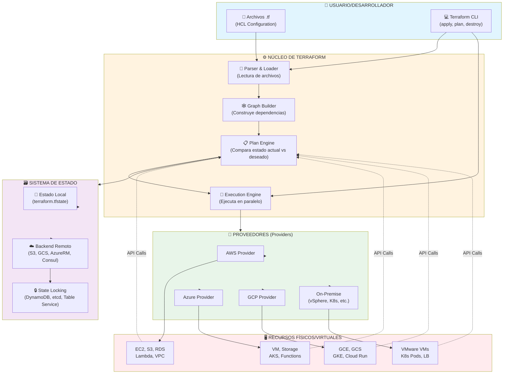
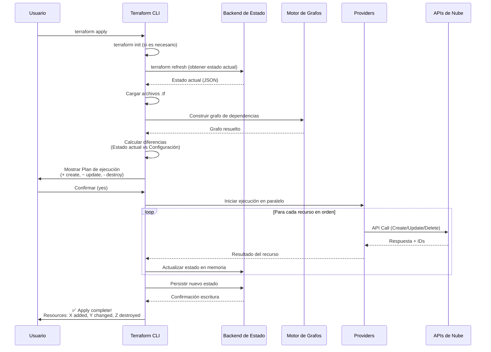
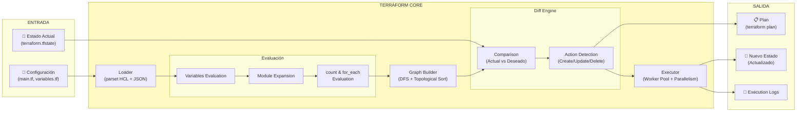
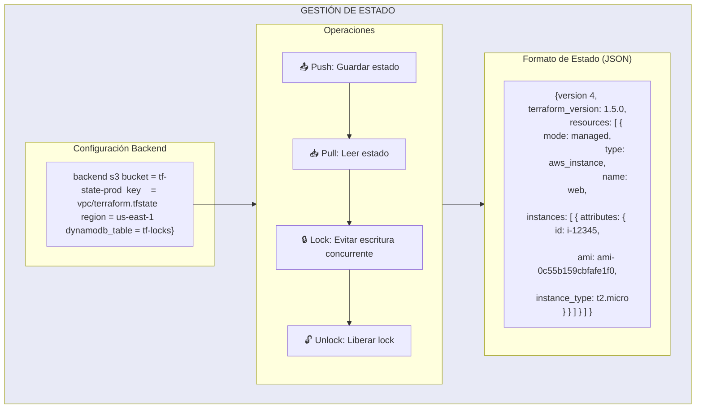
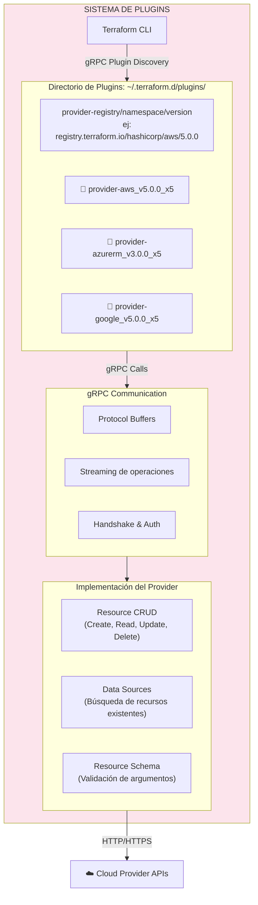
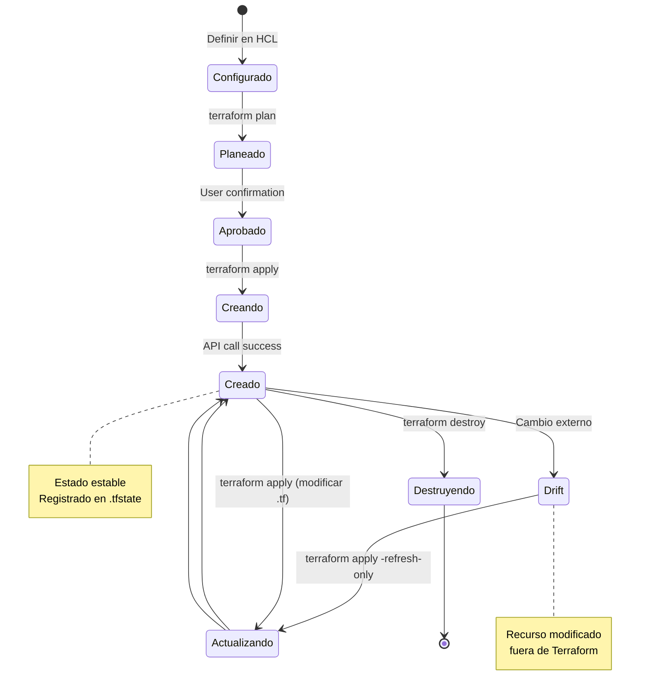
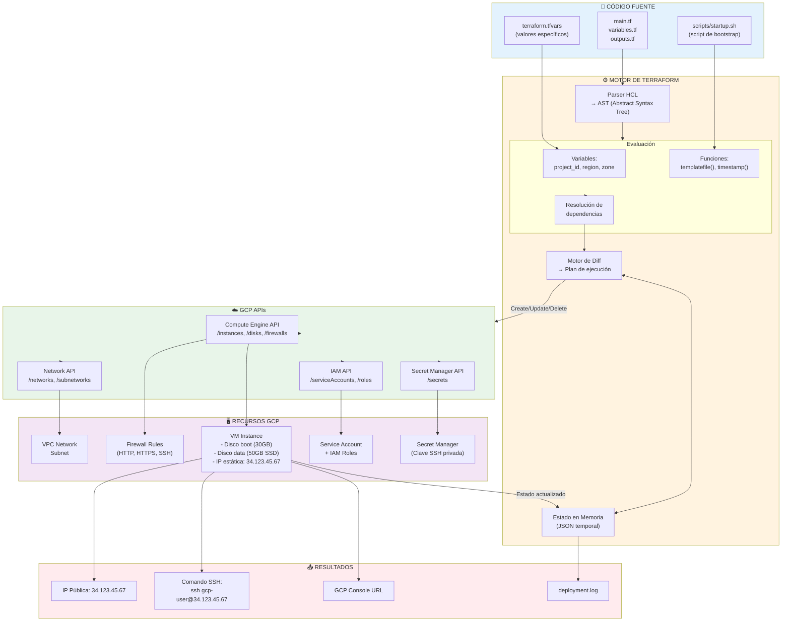
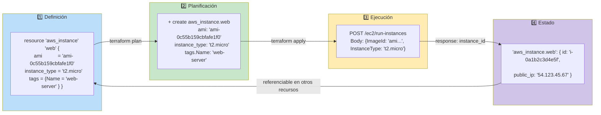
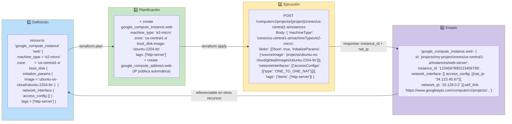
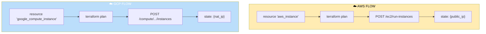

# Repositorio de Gobernanza Terraform.

# 1. Introducción.

# ¿Qué es Terraform? - Descripción Detallada con Arquitectura.

## 📌 Definición Fundamental.

**Terraform** es una herramienta de **Infraestructura como Código (IaC)** de código abierto desarrollada por HashiCorp que permite definir, provisionar y gestionar infraestructura en cualquier nube o entorno on-premise utilizando un lenguaje declarativo llamado **HCL (HashiCorp Configuration Language)**.

### Características Esenciales:
- **Declarativo**: Describes el "qué" (estado final deseado), no el "cómo" (pasos para llegar).
- **Independiente de plataforma**: Mismo flujo para AWS, Azure, GCP, vSphere, etc.
- **Manejo de estado**: Mantiene un mapa de tus recursos reales vs. configuración.
- **Plan de ejecución**: Muestra qué cambios hará antes de aplicarlos.
- **Grafo de dependencias**: Calcula automáticamente el orden correcto de operaciones.

---

## 🏗️ Arquitectura Flowchart de Terraform.

### Diagrama de Alto Nivel.

---

## 🔄 Flujo de Ejecución Detallado.

### Diagrama de Secuencia (Terraform Apply).

---

## 🧩 Componentes Arquitectónicos Clave.

### 1. **Núcleo (Core)** - Diagrama Interno.

### 2. **Sistema de Estado (State Management)**.

### 3. **Providers y Plugin System**.

---

## 📊 Diagrama de Ciclo de Vida de un Recurso.

---

## DIAGRAMA DE ARQUITECTURA DE DATOS (Cómo fluye la información).

---

## 🎯 Ejemplo Concreto con Flujo de Datos.

### Caso: Desplegar una VM en AWS.

### Caso: Desplegar una VM en GCP.

---

### 🔄 Comparación visual del flujo: AWS vs GCP.

## 📝 Diferencias clave AWS vs GCP

| Elemento | AWS | GCP |
|----------|-----|-----|
| **Recurso principal** | `aws_instance` | `google_compute_instance` |
| **Tipo de máquina** | `t2.micro` | `e2-micro` |
| **Imagen/AMI** | AMI ID (`ami-0c55...`) | Ruta de imagen (`ubuntu-os-cloud/ubuntu-2204-lts`) |
| **IP pública** | Automática (por defecto) | Requiere `access_config {}` explícito |
| **Firewall** | Security Group separado | Tags + Firewall Rules separados |
| **Zona/Región** | Solo región | Zona obligatoria (`us-central1-a`) |
| **ID del recurso** | `i-0a1b2c3d4e5f` | Ruta completa: `projects/.../instances/...` |
| **IP pública obtenida** | `public_ip` | `nat_ip` dentro de `access_config` |

---

## 🔐 Resumen de Conceptos Clave.

| Componente | Función | Ejemplo |
|------------|---------|---------|
| **Configuration (.tf)** | Define el estado deseado. | `resource "aws_s3_bucket" "google_compute_instance" "data" {...}` |
| **Provider** | Traduce Terraform → API específica. | `hashicorp/aws`, `hashicorp/azurerm` |
| **State** | Mapa de recursos reales. | `terraform.tfstate` (JSON) |
| **Backend** | Almacenamiento remoto del estado.| S3, GCS, Azure Storage, Consul |
| **Modules** | Contenedores reutilizables de recursos. | `module "vpc" { source = "terraform-aws-modules/vpc/aws" }` |
| **Plan** | Lista de cambios propuestos. | `terraform plan -out=tfplan` |

---

## 🎓 Entendimiento Final.

**Terraform NO es un simple script de aprovisionamiento**, sino un **orquestador declarativo con gestión de estado** que:

1. **Lee** tu configuración HCL
2. **Calcula** un grafo de dependencias automáticamente
3. **Compara** el estado actual con el deseado
4. **Genera** un plan de ejecución
5. **Ejecuta** solo las API calls necesarias, en orden óptimo y paralelo
6. **Persiste** el nuevo estado para futuras operaciones

---

Mario Fribla
***DevOps***
