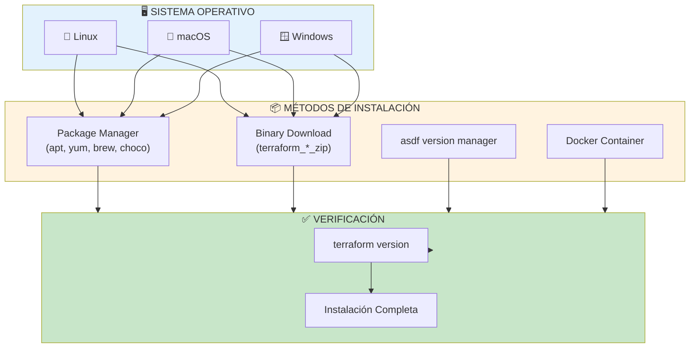
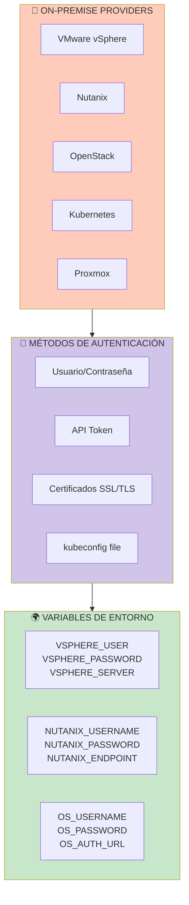
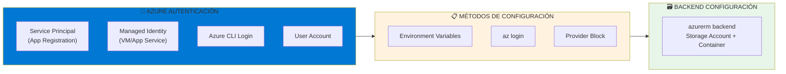
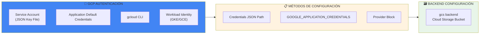
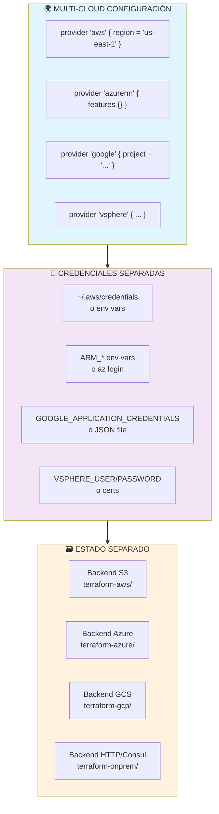

# Repostorio de Gobernanza Terraform.

# Instalación y Configuración de Terraform.

## 📋 Índice
1. [Instalación de Terraform (Multi-plataforma)](#instalación).
2. [Configuración On-Premise](#on-premise).
3. [Configuración AWS](#aws).
4. [Configuración Azure](#azure).
5. [Configuración GCP](#gcp).
6. [Configuración Multi-Cloud](#multi-cloud).
7. [Verificación y Troubleshooting](#verificación).

---

## 1️⃣ INSTALACIÓN DE TERRAFORM (Multi-plataforma).

### 📊 Flowchart de Instalación.


---

## Comandos de Instalación por Sistema Operativo.

## 🐧 **Linux (Ubuntu/Debian)**.

```bash
# Método 1: Official HashiCorp Repository
wget -O- https://apt.releases.hashicorp.com/gpg | gpg --dearmor | sudo tee /usr/share/keyrings/hashicorp-archive-keyring.gpg
echo "deb [signed-by=/usr/share/keyrings/hashicorp-archive-keyring.gpg] https://apt.releases.hashicorp.com $(lsb_release -cs) main" | sudo tee /etc/apt/sources.list.d/hashicorp.list
sudo apt update && sudo apt install terraform

# Método 2: Descarga directa
TERRAFORM_VERSION="1.7.0"
wget https://releases.hashicorp.com/terraform/${TERRAFORM_VERSION}/terraform_${TERRAFORM_VERSION}_linux_amd64.zip
unzip terraform_${TERRAFORM_VERSION}_linux_amd64.zip
sudo mv terraform /usr/local/bin/
terraform --version
```

## 🍎 **macOS**.

```bash
# Método 1: Homebrew (recomendado)
brew tap hashicorp/tap
brew install hashicorp/tap/terraform

# Método 2: MacPorts
sudo port install terraform

# Método 3: Descarga directa
curl -LO "https://releases.hashicorp.com/terraform/1.7.0/terraform_1.7.0_darwin_amd64.zip"
unzip terraform_1.7.0_darwin_amd64.zip
sudo mv terraform /usr/local/bin/
```

## 🪟 **Windows**.

```powershell
# Método 1: Chocolatey
choco install terraform

# Método 2: Winget
winget install Hashicorp.Terraform

# Método 3: Scoop
scoop install terraform

# Método 4: Manual
# 1. Descargar terraform_1.7.0_windows_amd64.zip
# 2. Extraer terraform.exe
# 3. Mover a C:\Windows\System32\ o agregar al PATH
```

## 🐳 **Docker (para CI/CD o entornos aislados)**.

```bash
# Usar imagen oficial
docker run -it --rm -v $(pwd):/workspace -w /workspace hashicorp/terraform:latest init
docker run -it --rm -v $(pwd):/workspace -w /workspace hashicorp/terraform:latest plan

# Docker Compose
cat > docker-compose.yml <<EOF
version: '3.8'
services:
  terraform:
    image: hashicorp/terraform:1.7.0
    volumes:
      - .:/workspace
    working_dir: /workspace
    environment:
      - AWS_ACCESS_KEY_ID
      - AWS_SECRET_ACCESS_KEY
      - GOOGLE_APPLICATION_CREDENTIALS
      - ARM_CLIENT_ID
      - ARM_CLIENT_SECRET
    entrypoint: terraform
EOF

docker-compose run --rm terraform init
```

---

## 2️⃣ CONFIGURACIÓN ON-PREMISE.

### Flowchart de Configuración On-Premise.



### 2.1 VMware vSphere.

```hcl
# providers.tf - vSphere
terraform {
  required_providers {
    vsphere = {
      source  = "hashicorp/vsphere"
      version = "~> 2.6"
    }
  }
}

provider "vsphere" {
  # Método 1: Variables explícitas
  user           = var.vsphere_user
  password       = var.vsphere_password
  vsphere_server = var.vsphere_server
  
  # Método 2: Permitir certificados inseguros (solo desarrollo)
  allow_unverified_ssl = true
  
  # Timeouts para conexión
  api_timeout = 30
}

# variables.tf
variable "vsphere_user" {
  description = "vSphere Username"
  type        = string
  sensitive   = true
}

variable "vsphere_password" {
  description = "vSphere Password"
  type        = string
  sensitive   = true
}

variable "vsphere_server" {
  description = "vCenter Server FQDN or IP"
  type        = string
  default     = "vcenter.example.com"
}

# terraform.tfvars (NO committear!)
vsphere_user     = "administrator@vsphere.local"
vsphere_password = "SuperSecret123!"
vsphere_server   = "vcenter.corp.local"

# Configuración mediante variables de entorno (alternativa)
# export VSPHERE_USER="administrator@vsphere.local"
# export VSPHERE_PASSWORD="SuperSecret123!"
# export VSPHERE_SERVER="vcenter.corp.local"
```

### 2.2 OpenStack.

```hcl
# providers.tf - OpenStack
terraform {
  required_providers {
    openstack = {
      source  = "terraform-provider-openstack/openstack"
      version = "~> 1.53"
    }
  }
}

provider "openstack" {
  # Usa variables de entorno OS_* automáticamente
  # O configura explícitamente:
  auth_url    = var.os_auth_url
  username    = var.os_username
  password    = var.os_password
  tenant_name = var.os_tenant_name
  region      = var.os_region
}

# Archivo openrc.sh (source antes de ejecutar terraform)
cat > openrc.sh <<'EOF'
export OS_AUTH_URL=https://openstack.corp.local:5000/v3
export OS_USERNAME=terraform_user
export OS_PASSWORD=SecurePassword123
export OS_PROJECT_NAME=production
export OS_USER_DOMAIN_NAME=Default
export OS_PROJECT_DOMAIN_NAME=Default
export OS_REGION_NAME=RegionOne
export OS_INTERFACE=public
export OS_IDENTITY_API_VERSION=3
EOF

source openrc.sh
terraform plan
```

### 2.3 Kubernetes On-Premise (kubeconfig).

```hcl
# providers.tf - Kubernetes
terraform {
  required_providers {
    kubernetes = {
      source  = "hashicorp/kubernetes"
      version = "~> 2.25"
    }
    helm = {
      source  = "hashicorp/helm"
      version = "~> 2.12"
    }
  }
}

provider "kubernetes" {
  # Usar kubeconfig del clúster local
  config_path = var.kubeconfig_path
  
  # O configuración directa
  # host                   = "https://k8s-api.corp.local:6443"
  # client_certificate     = file("~/.kube/client-cert.pem")
  # client_key             = file("~/.kube/client-key.pem")
  # cluster_ca_certificate = file("~/.kube/ca-cert.pem")
}

provider "helm" {
  kubernetes {
    config_path = var.kubeconfig_path
  }
}

variable "kubeconfig_path" {
  default = "~/.kube/config"
}

# export KUBECONFIG=/path/to/kubeconfig
```

---

## 3️⃣ CONFIGURACIÓN AWS.

### Flowchart de Configuración AWS.

```mermaid
flowchart LR
    subgraph AWS_AUTH["🔐 AWS AUTENTICACIÓN"]
        IAM_USER["IAM User<br/>(Access Key + Secret)"]
        IAM_ROLE["IAM Role<br/>(Assumed via STS)"]
        INSTANCE_PROFILE["Instance Profile<br/>(EC2/ECS/EKS)"]
        SSO["AWS SSO"]
    end
    
    subgraph METHODS["📋 MÉTODOS DE CONFIGURACIÓN"]
        SHARED["~/.aws/credentials"]
        ENV_VARS["Environment Variables"]
        PROV["Provider Block"]
        TFC["Terraform Cloud"]
    end
    
    subgraph BACKEND["🗃️ BACKEND CONFIGURACIÓN"]
        S3_BACKEND["s3 backend with DynamoDB lock"]
    end
    
    AWS_AUTH --> METHODS
    METHODS --> BACKEND
    
    style AWS_AUTH fill:#ffccbc
    style METHODS fill:#fff3e0
    style BACKEND fill:#e8f5e9
```



### Configuración de AWS Provider.

# providers.tf - AWS.

```hcl
terraform {
  required_version = ">= 1.5.0"
  
  required_providers {
    aws = {
      source  = "hashicorp/aws"
      version = "~> 5.0"
    }
    random = {
      source  = "hashicorp/random"
      version = "~> 3.5"
    }
  }
  
  # Backend S3 con locking
  backend "s3" {
    bucket         = "terraform-state-company-2024"
    key            = "env/${var.environment}/terraform.tfstate"
    region         = "us-east-1"
    encrypt        = true
    dynamodb_table = "terraform-state-locks"
    kms_key_id     = "alias/terraform-state-key"
  }
}

# Provider principal
provider "aws" {
  region = var.aws_region
  
  # Tags por defecto para todos los recursos
  default_tags {
    tags = {
      Environment   = var.environment
      ManagedBy     = "Terraform"
      Project       = var.project_name
      TerraformVersion = terraform.version
    }
  }
  
  # Configuración de perfiles
  profile = var.aws_profile != "" ? var.aws_profile : null
  
  # Timeouts y retries
  max_retries = 5
  
  # Endpoints personalizados (para GovCloud o China)
  # endpoints {
  #   ec2 = "https://ec2.us-gov-west-1.amazonaws.com"
  # }
}

# Provider para múltiples regiones
provider "aws" {
  alias  = "failover"
  region = "us-west-2"
  
  default_tags {
    tags = {
      Region = "failover"
    }
  }
}

# Provider para cuenta de auditoría
provider "aws" {
  alias  = "audit"
  region = "us-east-1"
  
  assume_role {
    role_arn = "arn:aws:iam::123456789012:role/AuditRole"
    session_name = "terraform-audit-session"
  }
}

```

# variables.tf - AWS.
```hcl
variable "aws_region" {
  description = "AWS Region"
  type        = string
  default     = "us-east-1"
}

variable "aws_profile" {
  description = "AWS CLI Profile name"
  type        = string
  default     = "default"
}

variable "environment" {
  description = "Environment name"
  type        = string
  validation {
    condition     = can(regex("^(dev|stg|prod)$", var.environment))
    error_message = "Environment must be dev, stg, or prod"
  }
}
```

# main.tf - AWS.
```hcl
# Crear bucket S3 para estado (si no existe)
resource "aws_s3_bucket" "terraform_state" {
  bucket = "terraform-state-company-2024"
  
  lifecycle {
    prevent_destroy = true
  }
}

resource "aws_s3_bucket_versioning" "terraform_state" {
  bucket = aws_s3_bucket.terraform_state.id
  versioning_configuration {
    status = "Enabled"
  }
}

resource "aws_dynamodb_table" "terraform_locks" {
  name         = "terraform-state-locks"
  billing_mode = "PAY_PER_REQUEST"
  hash_key     = "LockID"
  
  attribute {
    name = "LockID"
    type = "S"
  }
}
```

### Métodos de Autenticación AWS.

```bash
# MÉTODO 1: AWS CLI Configuración (~/.aws/credentials)
aws configure --profile terraform
# AWS Access Key ID: AKIA...
# AWS Secret Access Key: ...
# Default region: us-east-1
# Default output: json

# export AWS_PROFILE=terraform

# MÉTODO 2: Variables de entorno
export AWS_ACCESS_KEY_ID="AKIA..."
export AWS_SECRET_ACCESS_KEY="..."
export AWS_DEFAULT_REGION="us-east-1"
export AWS_SESSION_TOKEN="..."  # Si aplica

# MÉTODO 3: IAM Role (en EC2/EKS)
# No necesita credenciales explícitas, usa instance profile

# MÉTODO 4: Assume Role (seguridad mejorada)
cat > assume-role-policy.json <<EOF
{
  "Version": "2012-10-17",
  "Statement": [
    {
      "Effect": "Allow",
      "Action": "sts:AssumeRole",
      "Resource": "arn:aws:iam::123456789012:role/TerraformRole"
    }
  ]
}
EOF

# MÉTODO 5: AWS SSO
aws sso login --profile terraform-sso
export AWS_PROFILE=terraform-sso
```

---

## 4️⃣ CONFIGURACIÓN AZURE.

### Flowchart de Configuración Azure.



### Configuración de Azure Provider.

# providers.tf - Azure.
```hcl
terraform {
  required_version = ">= 1.5.0"
  
  required_providers {
    azurerm = {
      source  = "hashicorp/azurerm"
      version = "~> 3.0"
    }
    random = {
      source  = "hashicorp/random"
      version = "~> 3.5"
    }
  }
  
  # Backend Azure Storage
  backend "azurerm" {
    resource_group_name  = "terraform-state-rg"
    storage_account_name = "tfstate2024company"
    container_name       = "terraform-state"
    key                  = "env/${var.environment}/terraform.tfstate"
    # use_azuread_auth    = true  # Para usar Azure AD en lugar de keys
  }
}

# Provider principal
provider "azurerm" {
  features {
    # Configuración de features (recomendado)
    resource_group {
      prevent_deletion_if_contains_resources = true
    }
    
    key_vault {
      purge_soft_delete_on_destroy    = true
      recover_soft_deleted_key_vaults = true
    }
    
    virtual_machine {
      delete_os_disk_on_deletion = true
    }
  }
  
  # Autenticación mediante Service Principal
  client_id       = var.azure_client_id
  client_secret   = var.azure_client_secret
  tenant_id       = var.azure_tenant_id
  subscription_id = var.azure_subscription_id
  
  # Alternativa: usar Azure CLI (az login)
  # skip_provider_registration = false
}

# Provider para múltiples suscripciones
provider "azurerm" {
  alias           = "network"
  subscription_id = var.network_subscription_id
  features {}
}
```

# variables.tf - Azure
```hcl
variable "azure_client_id" {
  description = "Azure Service Principal Client ID"
  type        = string
  sensitive   = true
}

variable "azure_client_secret" {
  description = "Azure Service Principal Client Secret"
  type        = string
  sensitive   = true
}

variable "azure_tenant_id" {
  description = "Azure Tenant ID"
  type        = string
  sensitive   = true
}

variable "azure_subscription_id" {
  description = "Azure Subscription ID"
  type        = string
  sensitive   = true
}
```

# terraform.tfvars (NO committear!) - Azure
```hcl
azure_client_id     = "12345678-1234-1234-1234-123456789012"
azure_client_secret = "YourSuperSecretHere"
azure_tenant_id     = "87654321-4321-4321-4321-210987654321"
azure_subscription_id = "aaaaaaaa-bbbb-cccc-dddd-eeeeeeeeeeee"
```

### Creación de Service Principal en Azure.

```bash
# MÉTODO 1: Azure CLI - Crear Service Principal
az login

# Crear SP con contribuidor en suscripción
az ad sp create-for-rbac --name "terraform-sp" \
  --role contributor \
  --scopes /subscriptions/{subscription-id} \
  --sdk-auth

# Output JSON (guardar como AZURE_CREDENTIALS)
{
  "clientId": "12345678-1234-1234-1234-123456789012",
  "clientSecret": "secretValue",
  "subscriptionId": "aaaaaaaa-bbbb-cccc-dddd-eeeeeeeeeeee",
  "tenantId": "87654321-4321-4321-4321-210987654321",
  "activeDirectoryEndpointUrl": "https://login.microsoftonline.com",
  "resourceManagerEndpointUrl": "https://management.azure.com/",
  "activeDirectoryGraphResourceId": "https://graph.windows.net/",
  "sqlManagementEndpointUrl": "https://management.core.windows.net:8443/",
  "galleryEndpointUrl": "https://gallery.azure.com/",
  "managementEndpointUrl": "https://management.core.windows.net/"
}

# MÉTODO 2: Variables de entorno
export ARM_CLIENT_ID="12345678-1234-1234-1234-123456789012"
export ARM_CLIENT_SECRET="secretValue"
export ARM_SUBSCRIPTION_ID="aaaaaaaa-bbbb-cccc-dddd-eeeeeeeeeeee"
export ARM_TENANT_ID="87654321-4321-4321-4321-210987654321"

# MÉTODO 3: Usar Azure CLI (más simple para desarrollo)
az login
# Terraform usará automáticamente las credenciales de az login

# MÉTODO 4: Managed Identity (en VM de Azure)
# No necesita variables, Terraform detecta automáticamente

# Crear Storage Account para backend
az storage account create \
  --name "tfstate2024company" \
  --resource-group "terraform-state-rg" \
  --location "eastus" \
  --sku "Standard_LRS" \
  --kind "StorageV2" \
  --https-only true

az storage container create \
  --name "terraform-state" \
  --account-name "tfstate2024company" \
  --auth-mode login
```

---

## 5️⃣ CONFIGURACIÓN GCP.

### Flowchart de Configuración GCP.



### Configuración de GCP Provider.

# providers.tf - GCP.
```hcl
terraform {
  required_version = ">= 1.5.0"
  
  required_providers {
    google = {
      source  = "hashicorp/google"
      version = "~> 5.0"
    }
    random = {
      source  = "hashicorp/random"
      version = "~> 3.5"
    }
  }
  
  # Backend GCS
  backend "gcs" {
    bucket = "terraform-state-company-2024"
    prefix = "env/${var.environment}"
  }
}

# Provider principal
provider "google" {
  project = var.gcp_project_id
  region  = var.gcp_region
  zone    = var.gcp_zone
  
  # Autenticación mediante JSON key
  credentials = file(var.gcp_credentials_file)
  
  # O usar Application Default Credentials
  # credentials = "GOOGLE_APPLICATION_CREDENTIALS"
  
  # Request timeout
  request_timeout = "60s"
  
  # Batching (mejora rendimiento)
  disable_telemetry = false
}

# Provider para múltiples regiones
provider "google" {
  alias   = "europe"
  project = var.gcp_project_id
  region  = "europe-west1"
  zone    = "europe-west1-b"
  credentials = file(var.gcp_credentials_file)
}

# Provider para diferentes proyectos
provider "google" {
  alias   = "security"
  project = "security-project-123456"
  credentials = file(var.gcp_credentials_file)
}
```

# variables.tf - GCP.
```hcl
variable "gcp_project_id" {
  description = "GCP Project ID"
  type        = string
  validation {
    condition     = can(regex("^[a-z][a-z0-9-]{4,28}[a-z0-9]$", var.gcp_project_id))
    error_message = "Invalid project ID format"
  }
}

variable "gcp_region" {
  description = "GCP Region"
  type        = string
  default     = "us-central1"
}

variable "gcp_zone" {
  description = "GCP Zone"
  type        = string
  default     = "us-central1-a"
}

variable "gcp_credentials_file" {
  description = "Path to GCP Service Account JSON key file"
  type        = string
  default     = "~/.gcp/terraform-sa-key.json"
}

variable "environment" {
  type = string
}
```

# terraform.tfvars - GCP.
```hcl
gcp_project_id        = "my-company-project-123456"
gcp_region           = "us-central1"
gcp_zone             = "us-central1-a"
environment          = "production"
gcp_credentials_file = "/secure/secrets/gcp-key.json"
```

### Creación de Service Account en GCP.

```bash
# MÉTODO 1: gcloud CLI - Crear Service Account
gcloud auth login
gcloud config set project my-company-project-123456

# Crear service account
gcloud iam service-accounts create terraform-sa \
  --display-name="Terraform Service Account"

# Asignar roles (mínimo privilegio)
gcloud projects add-iam-policy-binding my-company-project-123456 \
  --member="serviceAccount:terraform-sa@my-company-project-123456.iam.gserviceaccount.com" \
  --role="roles/compute.admin"

gcloud projects add-iam-policy-binding my-company-project-123456 \
  --member="serviceAccount:terraform-sa@my-company-project-123456.iam.gserviceaccount.com" \
  --role="roles/iam.serviceAccountUser"

gcloud projects add-iam-policy-binding my-company-project-123456 \
  --member="serviceAccount:terraform-sa@my-company-project-123456.iam.gserviceaccount.com" \
  --role="roles/storage.admin"

# Crear y descargar clave JSON
gcloud iam service-accounts keys create ~/.gcp/terraform-sa-key.json \
  --iam-account=terraform-sa@my-company-project-123456.iam.gserviceaccount.com

# MÉTODO 2: Variables de entorno
export GOOGLE_APPLICATION_CREDENTIALS="/secure/secrets/gcp-key.json"
export GOOGLE_PROJECT="my-company-project-123456"
export GOOGLE_REGION="us-central1"
export GOOGLE_ZONE="us-central1-a"

# MÉTODO 3: Workload Identity (para GKE)
# En GKE, Terraform puede usar la identidad del pod

# Crear bucket GCS para estado
gsutil mb -l us-central1 gs://terraform-state-company-2024
gsutil versioning set on gs://terraform-state-company-2024

# Habilitar APIs necesarias
gcloud services enable compute.googleapis.com
gcloud services enable iam.googleapis.com
gcloud services enable cloudresourcemanager.googleapis.com
gcloud services enable storage-api.googleapis.com
```

---

## 6️⃣ CONFIGURACIÓN MULTI-CLOUD.

### Flowchart de Configuración Multi-Cloud.



---

### Estructura de Proyecto Multi-Cloud.

```bash
multi-cloud-infra/
├── environments/
│   ├── dev/
│   │   ├── aws/
│   │   │   ├── main.tf
│   │   │   ├── variables.tf
│   │   │   ├── outputs.tf
│   │   │   └── terraform.tfvars
│   │   ├── azure/
│   │   │   └── ...
│   │   └── gcp/
│   │       └── ...
│   └── prod/
│       ├── aws/
│       ├── azure/
│       └── gcp/
├── modules/
│   ├── compute/
│   ├── networking/
│   └── security/
└── global/
    ├── iam/
    └── dns/
```
---

### Configuración Unificada con Workspaces.

```hcl
# versions.tf - Multi-cloud
terraform {
  required_version = ">= 1.5.0"
  
  required_providers {
    aws = {
      source  = "hashicorp/aws"
      version = "~> 5.0"
    }
    azurerm = {
      source  = "hashicorp/azurerm"
      version = "~> 3.0"
    }
    google = {
      source  = "hashicorp/google"
      version = "~> 5.0"
    }
    vsphere = {
      source  = "hashicorp/vsphere"
      version = "~> 2.6"
    }
  }
}

# Configuración dinámica de backend según workspace
# (Usando Terragrunt o scripts personalizados)

# main.tf - Configuración multi-cloud
locals {
  environment = terraform.workspace
}

# AWS Provider
provider "aws" {
  region = var.aws_regions[local.environment]
  
  default_tags {
    tags = {
      Environment = local.environment
      ManagedBy   = "Terraform"
    }
  }
}

# Azure Provider
provider "azurerm" {
  features {}
  
  subscription_id = var.azure_subscriptions[local.environment]
  client_id       = var.azure_client_id
  client_secret   = var.azure_client_secret
  tenant_id       = var.azure_tenant_id
}

# GCP Provider
provider "google" {
  project     = var.gcp_projects[local.environment]
  region      = var.gcp_regions[local.environment]
  credentials = file(var.gcp_credentials_files[local.environment])
}

# vSphere Provider (On-Premise)
provider "vsphere" {
  user           = var.vsphere_users[local.environment]
  password       = var.vsphere_passwords[local.environment]
  vsphere_server = var.vsphere_servers[local.environment]
  allow_unverified_ssl = local.environment != "prod"
}

# variables.tf
variable "aws_regions" {
  type = map(string)
  default = {
    dev  = "us-east-1"
    stg  = "us-east-1"
    prod = "us-east-1"
  }
}

variable "azure_subscriptions" {
  type = map(string)
  sensitive = true
}

variable "gcp_projects" {
  type = map(string)
}

# archivo de variables específico por entorno
# dev.tfvars
aws_regions = {
  dev = "us-west-2"
}
azure_subscriptions = {
  dev = "12345678-1234-1234-1234-123456789012"
}
gcp_projects = {
  dev = "my-company-dev-123456"
}

# Uso de workspaces
terraform workspace new dev
terraform workspace new stg
terraform workspace new prod

terraform workspace select dev
terraform apply -var-file="dev.tfvars"
```
---

### Script de Automatización Multi-Cloud.

```bash
#!/bin/bash
# deploy-multi-cloud.sh

set -e

ENVIRONMENTS=("dev" "stg" "prod")
CLOUDS=("aws" "azure" "gcp" "onprem")

for env in "${ENVIRONMENTS[@]}"; do
    echo "========================================="
    echo "Desplegando entorno: $env"
    echo "========================================="
    
    for cloud in "${CLOUDS[@]}"; do
        echo "--- Desplegando en $cloud ---"
        
        cd "./environments/$env/$cloud" || exit 1
        
        # Inicializar con backend específico
        terraform init -reconfigure \
            -backend-config="backend-${cloud}.tfvars"
        
        # Seleccionar workspace
        terraform workspace select "$env" || terraform workspace new "$env"
        
        # Plan y apply
        terraform plan -out="plan-${cloud}.tfplan" \
            -var-file="../../global.tfvars" \
            -var-file="${env}.tfvars"
        
        terraform apply "plan-${cloud}.tfplan"
        
        cd - || exit 1
    done
    
    echo "✅ Entorno $env completado"
done

echo "🎉 Todos los despliegues multi-cloud completados"
```

---

## 7️⃣ VERIFICACIÓN Y TROUBLESHOOTING.
### Comandos de Verificación.

```bash
# Verificar instalación
terraform version
# Terraform v1.7.0
# on linux_amd64

# Verificar proveedores instalados
terraform providers
# Providers required by configuration:
# .
# ├── provider[registry.terraform.io/hashicorp/aws] ~> 5.0
# ├── provider[registry.terraform.io/hashicorp/azurerm] ~> 3.0
# ├── provider[registry.terraform.io/hashicorp/google] ~> 5.0
# └── provider[registry.terraform.io/hashicorp/vsphere] ~> 2.6

# Verificar autenticación (AWS)
aws sts get-caller-identity

# Verificar autenticación (Azure)
az account show

# Verificar autenticación (GCP)
gcloud auth print-access-token | head -1

# Verificar credenciales de Terraform
terraform plan -refresh-only

# Verificar backend remoto
terraform state list

# Debugging
export TF_LOG=DEBUG
export TF_LOG_PATH=terraform-debug.log
terraform plan

export TF_LOG=TRACE  # Para debugging extremo

# Verificar formato
terraform fmt -recursive -check -diff

# Validar sintaxis
terraform validate

# Verificar dependencias
terraform graph | dot -Tpng > graph.png
```
---

### Tabla de Troubleshooting Rápido.

| Problema | Causa común | Solución |
|----------|-------------|----------|
| `provider not found` | Versión incorrecta | `terraform init -upgrade` |
| `access denied` | Credenciales inválidas | Verificar `~/.aws/credentials` o `az login` |
| `state lock error` | Otro proceso usando estado | Esperar o `terraform force-unlock` |
| `backend not configured` | Falta backend block | Añadir backend después de `terraform init -reconfigure` |
| `resource already exists` | Estado desactualizado | `terraform import` o `terraform refresh` |
| `timeout error` | Red/API lenta | Ajustar `TF_CLI_CONFIG_FILE` con timeout |

---

### Configuración de Timeouts y Retries.

```hcl
# ~/.terraformrc (CLI Configuration)
provider_installation {
  filesystem_mirror {
    path    = "/usr/share/terraform/providers"
    include = ["example.com/*/*"]
  }
  direct {
    exclude = ["example.com/*/*"]
  }
}

# Variables de entorno para timeouts
export TF_CLI_CONFIG_FILE="$HOME/.terraformrc"
export TF_INPUT=0  # No prompt para confirmación
export TF_PLUGIN_CACHE_DIR="$HOME/.terraform.d/plugin-cache"

# CLI args en scripts
terraform plan -parallelism=10 -refresh=true -input=false
terraform apply -auto-approve -lock-timeout=300s
```

---

## 📊 RESUMEN RÁPIDO DE CONFIGURACIÓN.

| Cloud | Provider | Mínimo necesario | Backend recomendado |
|-------|----------|------------------|---------------------|
| **AWS** | `hashicorp/aws` | `region` + credenciales | S3 + DynamoDB |
| **Azure** | `hashicorp/azurerm` | `subscription_id` + SP | Azure Storage |
| **GCP** | `hashicorp/google` | `project` + credentials JSON | GCS |
| **vSphere** | `hashicorp/vsphere` | `user` + `password` + `server` | HTTP/Consul |
| **K8s** | `hashicorp/kubernetes` | `config_path` o kubeconfig | K8s secrets |

---

Mario Fribla
***DevOps***
